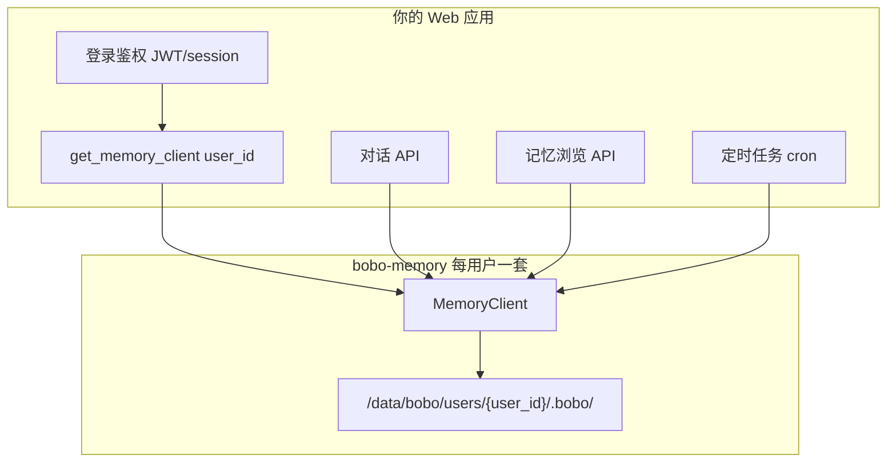

# bobo-memory Web / 多用户集成教程（Agent 专用）

> **用途**：将本文整段粘贴给编码 Agent（Cursor、Claude Code 等），在**带登录的多用户 Web 项目**中自动生成 bobo-memory 集成代码。  
> **适用场景**：SQL Agent、客服 Bot、研究助手等「用户登录 + 服务端部署 + 每用户独立记忆」的产品。  
> **原则**：bobo-memory 不调用 LLM；你的应用负责鉴权、调度与 UI，库负责 prompt 片段、工具定义与 Markdown 落盘。

**相关文档**（按需查阅，本文已自洽）：

| 文档 | 内容 |
|------|------|
| [INTEGRATION_zh.md](INTEGRATION_zh.md) | 通用集成规范、工具协议、目录约定 |
| [AGENT_BRIEF_zh.md](AGENT_BRIEF_zh.md) | 单页速查（单项目 / 本地） |
| [TUTORIAL_zh.md](TUTORIAL_zh.md) | 人类逐步教程 |

---

## 0. 给编码 Agent 的执行摘要

```text
任务：在 <你的 Web 项目> 中集成 bobo-memory（多用户）。

必须做到：
1. pip install bobo-memory；禁止在服务器上对应用仓库全局执行一次 bobo-memory init 给所有用户共用。
2. 每个登录用户对应独立 project_root（推荐 /data/bobo/users/{user_id}/），首次访问时代码懒初始化 MemoryClient。
3. 对话链路：build_system_prompt + to_openai_tools + dispatch_tool_call；禁止手写 .bobo/memory/*.md。
4. 提供「我的记忆」API：memory_list / memory_read / memory_forget（走现有鉴权）。
5. 配置 policy 磁盘治理；部署 cron 每日 client.run_janitor()；可选 storage_stats 监控。
6. enabled_layers 默认仅 auto + session；无知识库需求不要开 wiki/raw。

验收：
- 用户 A 的记忆用户 B 不可见；
- memory_save 后该用户目录下有 .md 且 MEMORY.md 有索引；
- run_janitor 可执行且返回报告；storage_stats 有 layers 字段。
```

---

## 1. 架构：多用户 vs 单项目

bobo-memory **没有**内置「注册用户 / user_id」概念。多用户隔离由**应用层**完成：每个用户一个独立的 `project_root` 目录。



| 概念 | bobo-memory | 你的应用 |
|------|-------------|----------|
| 用户身份 | 无 | `user_id`（数据库主键） |
| 记忆隔离 | `project_root` 指向不同目录 | 映射 `user_id → 目录` |
| `scope=project` | 该目录下的 `.bobo/memory/...` | 语义 =「该用户的私有工作区」，非团队 Git 仓库 |
| 团队共享 | `team` / `wiki` 层（可选） | 多用户共用一个 `project_root` 时才用 |

**不要**在服务器项目根执行一次 `bobo-memory init` 让所有用户共用同一 `.bobo/`。

---

## 2. 目录与初始化（代码懒初始化）

### 2.1 推荐目录布局

```text
/data/bobo/                          # 持久化卷（云盘 PVC / EBS）
  users/
    {user_id}/
      .bobo/
        config.yaml                  # 可选；也可全靠代码参数
        memory/
          auto/                      # 用户偏好、SQL 习惯、常用表说明
            MEMORY.md
            *.md
          session/                   # 长对话摘要（按 session_id）
          agent/<agent_type>/project/  # 若启用 agent 层
        audit/
          audit-YYYY-MM-DD.jsonl
```

### 2.2 每用户 MemoryClient 工厂（复制即用）

```python
from pathlib import Path
from functools import lru_cache

from bobo_memory import MemoryClient
from bobo_memory.config import BoboConfig

# 按部署修改
BOBO_DATA_ROOT = Path("/data/bobo/users")
AGENT_TYPE = "sql-agent"          # 与产品一致，全进程统一
ENABLED_LAYERS = ["auto", "session"]  # Web SQL Agent 推荐；无知识库勿开 wiki


def user_project_root(user_id: str) -> Path:
    """一个用户一个根目录 — 隔离边界。"""
    root = BOBO_DATA_ROOT / str(user_id)
    root.mkdir(parents=True, exist_ok=True)
    return root


def ensure_user_config(root: Path) -> None:
    """首次使用时写入 config（可选，便于运维查看）。"""
    cfg_path = root / ".bobo" / "config.yaml"
    if cfg_path.exists():
        return
    cfg = BoboConfig(
        agent_type=AGENT_TYPE,
        scope="project",
        enabled_layers=ENABLED_LAYERS,
        project_root=root,
    )
    # 建议写入磁盘治理 policy（见 §5）
    cfg.policy.max_files_per_layer = {"auto": 200}
    cfg.policy.session.max_age_days = 90
    cfg.policy.audit.retention_days = 90
    cfg.policy.raw.max_file_size_kb = 1024
    cfg.policy.max_file_size_kb = 50
    cfg.save(cfg_path)


@lru_cache(maxsize=10_000)
def get_memory_client(user_id: str) -> MemoryClient:
    """
    进程内缓存 client；多 worker 时每个进程一份缓存。
    换用户必须换 user_id，禁止复用同一 client 给不同用户。
    """
    root = user_project_root(user_id)
    ensure_user_config(root)
    return MemoryClient(
        project_root=root,
        agent_type=AGENT_TYPE,
        scope="project",
        enabled_layers=ENABLED_LAYERS,
    )
```

**说明**：

- **不必**在 shell 执行 `bobo-memory init`；`MemoryClient(...)` 会自动创建 `.bobo/memory/` 等目录。
- `bobo-memory init` 仅适合本地单项目开发；生产用上面工厂即可。
- 多实例部署：共享存储（NFS / 云 NAS / K8s RWX PVC），或会话粘滞到固定节点（不推荐长期）。

### 2.3 会话维度（session_id）

`session` 层按**聊天会话**分文件（`.bobo/memory/session/{session_id}.md`），与 `user_id` 正交：

```python
import uuid

mem = get_memory_client(user_id)
chat_session_id = "<来自你 DB 的会话 ID>"  # 或 uuid.uuid4().hex

# 调用 session 相关方法时传入 session_id，例如：
session_path = mem.session.path(session_id=chat_session_id)
# should_extract / build_extract_prompt 同样支持 session_id= 参数

# 若整个请求周期复用同一 client，也可在首次绑定时：
mem.session._session_id = chat_session_id
```

同一用户多个对话 = 多个 `session/*.md`，由 `policy.session.max_age_days` + `run_janitor()` 清理过期文件。

---

## 3. 对话集成（LLM 链路）

与单项目相同，**每个请求**从当前用户的 client 取 prompt 与 tools：

```python
import json
from bobo_memory import MemoryClient


def prepare_chat(user_id: str, role_prompt: str, user_messages: list[dict]):
    mem = get_memory_client(user_id)
    system = mem.build_system_prompt(role_prompt)  # 只写业务角色，勿手写记忆教程
    tools = mem.to_openai_tools()
    messages = [{"role": "system", "content": system}, *user_messages]
    return mem, messages, tools


def handle_tool_calls(mem: MemoryClient, tool_calls: list) -> list[dict]:
    out = []
    for tc in tool_calls:
        args = json.loads(tc.function.arguments) if isinstance(tc.function.arguments, str) else tc.function.arguments
        result = mem.dispatch_tool_call(tc.function.name, args)
        out.append({
            "role": "tool",
            "tool_call_id": tc.id,
            "content": json.dumps(result, ensure_ascii=False),
        })
    return out
```

### 3.1 layer 选型（SQL Agent）

| 用户行为 | 工具 | layer |
|----------|------|-------|
| 「记住我喜欢用 JOIN」 | `memory_save` | `auto` |
| 项目/库表通用事实 | `memory_save` | `auto` |
| 仅本 Agent 类型习惯 | `memory_save` | `agent` |
| 检索历史记忆 | `memory_recall` | 默认查 enabled_layers |
| 上传 DDL/文档入库 | `ingest` + `ingest_next` | 需开 wiki/raw，**慎用** |

默认 **只开 `auto` + `session`**，避免 `raw/` 与 wiki 撑爆磁盘。

### 3.2 工具响应

- 成功：`{"ok": true, ...}`
- 失败：`{"ok": false, "error": "..."}`（含条数上限、敏感信息、文件过大）
- **必须**把完整 JSON 回传给 LLM，不要只传 `error` 字符串。

---

## 4. 记忆展示 API（Web UI）

**不要**对外暴露 `bobo-memory serve`（无鉴权、单 project_root）。在**你的后端**用登录态 + `dispatch_tool_call` 封装 REST API。

### 4.1 推荐路由

| 方法 | 路径 | 实现 |
|------|------|------|
| GET | `/api/memories` | `memory_list` layer=auto |
| GET | `/api/memories/{slug}` | `memory_read` file=`.bobo/memory/auto/{slug}.md` |
| POST | `/api/memories/search` | `memory_recall` query=... |
| DELETE | `/api/memories/{slug}` | `memory_forget` + 可选 `memory_purge` |

### 4.2 FastAPI 示例骨架

```python
from fastapi import APIRouter, Depends, HTTPException

router = APIRouter(prefix="/api/memories")


def parse_memory_index(index_md: str) -> list[dict]:
    """将 MEMORY.md 索引解析为 [{slug, summary, file}, ...]。"""
    items = []
    for line in index_md.splitlines():
        line = line.strip()
        if not line.startswith("- "):
            continue
        # 格式因版本而异，常见: - [summary](filename.md)
        # 实现时按实际 MEMORY.md 行格式解析
        items.append({"raw_line": line})
    return items


@router.get("")
def list_memories(user=Depends(get_current_user)):
    mem = get_memory_client(user.id)
    r = mem.dispatch_tool_call("memory_list", {"layer": "auto"})
    if not r.get("ok"):
        raise HTTPException(500, detail=r.get("error"))
    return {
        "items": parse_memory_index(r["index"]),
        "layer": "auto",
    }


@router.get("/{slug}")
def get_memory(slug: str, user=Depends(get_current_user)):
    mem = get_memory_client(user.id)
    rel = f".bobo/memory/auto/{slug}.md"
    r = mem.dispatch_tool_call("memory_read", {"file": rel})
    if not r.get("ok"):
        raise HTTPException(404, detail=r.get("error"))
    return {"slug": slug, "content": r["content"], "file": rel}


@router.delete("/{slug}")
def delete_memory(slug: str, user=Depends(get_current_user)):
    mem = get_memory_client(user.id)
    rel = f".bobo/memory/auto/{slug}.md"
    r = mem.dispatch_tool_call("memory_forget", {"file": rel, "reason": "user deleted"})
    if not r.get("ok"):
        raise HTTPException(400, detail=r.get("error"))
    return r
```

### 4.3 前端展示建议

- **列表页**：`memory_list` 索引 → 卡片列表（summary + 更新时间可从 frontmatter 解析）。
- **详情页**：`memory_read` → Markdown 渲染（react-markdown 等）。
- **搜索**：`memory_recall` → 高亮命中片段。
- **管理**：提供删除按钮调 `memory_forget`；回收站可选展示 `.trash/`（高级）。

### 4.4 安全要点

- 所有 API **必须先** `get_current_user`，再 `get_memory_client(user.id)`。
- 禁止客户端传入任意 `project_root` 或绝对路径。
- `memory_read` / `forget` 的 `file` 必须相对该用户的 root，且落在 `.bobo/memory/` 下（库内 guard 会校验）。

---

## 5. 磁盘治理策略（框架 + 应用）

框架已提供 **policy 配置 + 写入护栏 + run_janitor + storage_stats**；应用层负责 **cron 调度** 与 **业务配额**。

### 5.1 推荐 config.yaml（每用户目录可共用模板）

写入 `ensure_user_config` 或部署时复制模板：

```yaml
agent_type: sql-agent
scope: project
enabled_layers:
  - auto
  - session

policy:
  write_mode: direct
  max_file_size_kb: 50          # 单条记忆上限（SQL 偏好通常很短）
  max_files_per_layer:
    auto: 200                   # 新建记忆条数上限；超限需 forget 或 memory_update
  trash:
    retention_days: 30          # .trash 软删保留天数（janitor 执行）
    allow_purge: true
  session:
    max_age_days: 90            # 会话摘要过期；null = 不清理
  audit:
    retention_days: 90          # 审计 JSONL 保留；null = 不清理
  raw:
    max_file_size_kb: 1024      # ingest 单文档上限；null = 不限
```

### 5.2 框架自动行为（无需应用重复实现）

| 机制 | 行为 |
|------|------|
| `max_file_size_kb` | `memory_save` 写入前拒绝过大内容 |
| `max_files_per_layer` | **新建**文件达上限返回 `ok: false`；覆盖同 topic、`memory_update` 不受限 |
| `forbidden_patterns` | 拦截 API Key、私钥等写入 |
| `MEMORY.md` | 注入 prompt 前硬截断 200 行 / 25 KB |
| `ingest` + `raw.max_file_size_kb` | 超限文档进入 `skipped`，不写 raw |
| `run_janitor()` | 清理过期 trash / session / audit |

### 5.3 定时清理（应用 cron）

```python
def janitor_job_all_users(user_ids: list[str]) -> None:
    for uid in user_ids:
        try:
            mem = get_memory_client(uid)
            report = mem.run_janitor()
            # 可选：上报 metrics
            # metrics.gauge("bobo_janitor_freed_bytes", report["total_freed_bytes"], tags={"user": uid})
        except OSError as e:
            log.warning("janitor failed user=%s: %s", uid, e)
```

建议：**每日一次**（低峰）。`run_janitor()` 返回示例：

```json
{
  "trash": {"deleted_files": 2, "freed_bytes": 4096, "errors": []},
  "session": {"deleted_files": 5, "freed_bytes": 12000, "errors": []},
  "audit": {"deleted_files": 10, "freed_bytes": 80000, "errors": []},
  "total_freed_bytes": 96096
}
```

### 5.4 监控与告警（应用层）

```python
def check_user_quota(user_id: str, max_total_mb: int = 50) -> bool:
    mem = get_memory_client(user_id)
    stats = mem.storage_stats()
    total = stats.get("audit_bytes", 0)
    for layer, s in stats.get("layers", {}).items():
        total += s.get("bytes", 0) + s.get("trash_bytes", 0)
    return total <= max_total_mb * 1024 * 1024
```

`storage_stats()` 结构：

```json
{
  "project_root": "/data/bobo/users/42",
  "layers": {
    "auto": {"files": 12, "bytes": 45000, "trash_files": 1, "trash_bytes": 3000},
    "session": {"files": 3, "bytes": 9000, "trash_files": 0, "trash_bytes": 0}
  },
  "audit_bytes": 120000
}
```

### 5.5 存储与备份建议

| 阶段 | 建议 |
|------|------|
| 上线 | 云盘 `/data/bobo` 挂载；**热数据本地读写**，不将 OSS 作主存储 |
| 容灾 | 定时打包 `users/{id}/.bobo/` 上传 OSS（冷备） |
| 扩容 | 先调 policy 收紧 + janitor；用户量大再考虑分层存储 |

### 5.6 应用层额外配额（可选）

框架不知道「免费 50 条 / 付费 500 条」，可在 `memory_save` 前封装：

```python
def guarded_save(mem: MemoryClient, args: dict, *, max_auto: int) -> dict:
    stats = mem.storage_stats()
    n = stats.get("layers", {}).get("auto", {}).get("files", 0)
    if n >= max_auto and args.get("layer") == "auto":
        return {"ok": False, "error": f"记忆条数已达上限 {max_auto}"}
    return mem.dispatch_tool_call("memory_save", args)
```

---

## 6. 多实例与并发

| 场景 | 做法 |
|------|------|
| 单实例 | 直接文件存储 |
| 多 worker 写同一用户 | 需要**共享文件系统**；bobo-memory 使用 `filelock` 做进程间锁 |
| 无共享盘 | 会话粘滞到同一 worker，或每用户固定 shard 节点 |
| 读多写少 | `get_memory_client` 可 LRU 缓存；写后无需失效缓存（同进程路径一致） |

---

## 7. 反模式（Agent 不要生成以下代码）

| 错误 | 正确 |
|------|------|
| 全站一个 `MemoryClient(project_root=".")` | 每用户独立 `project_root` |
| 服务器上对应用 git 仓库 `bobo-memory init` | 代码懒初始化用户目录 |
| 用户浏览器直连 `bobo-memory serve` | 自建鉴权 API |
| 手写 `.bobo/memory/foo.md` | `dispatch_tool_call("memory_save", ...)` |
| 自写记忆教学 prompt | `build_system_prompt(仅业务角色)` |
| 不开 wiki 却大量 `ingest` PDF | 大文件放 OSS/DB，记忆只存摘要 |
| 从不跑 `run_janitor` | cron + `policy.session/audit/trash` |

---

## 8. 集成检查清单

```
[ ] pip install bobo-memory
[ ] BOBO_DATA_ROOT 持久化卷挂载
[ ] get_memory_client(user_id) 工厂 + ensure_user_config
[ ] 对话：build_system_prompt / to_openai_tools / dispatch_tool_call
[ ] 记忆 API：list / read / forget（鉴权）
[ ] policy：max_files_per_layer、session/audit/trash、max_file_size_kb
[ ] cron：run_janitor() 每日
[ ] （可选）storage_stats 监控 + 单用户配额
[ ] enabled_layers = [auto, session]（按需加 agent）
[ ] 验收：用户 A/B 记忆互不可见；save + list + recall 正常
```

---

## 9. 可复制任务描述（粘贴给编码 Agent）

```text
在本 Web 项目中集成 bobo-memory（多用户）。

参考文档：docs/AGENT_SAAS_TUTORIAL_zh.md（主）、docs/INTEGRATION_zh.md（工具协议）。

实现要求：
1. 目录：/data/bobo/users/{user_id}/ 作为 project_root；禁止全局 init 共用 .bobo。
2. get_memory_client(user_id) 懒初始化 + BoboConfig/policy 磁盘治理配置。
3. 聊天服务：每请求 build_system_prompt + to_openai_tools + dispatch_tool_call。
4. REST：GET /api/memories、GET /api/memories/{slug}、DELETE /api/memories/{slug}，必须登录鉴权。
5. 定时任务：遍历活跃用户 run_janitor()。
6. enabled_layers 默认 ["auto", "session"]；agent_type 常量如 "sql-agent"。

不要：bobo-memory serve 对外、手写 md、单 client 多用户、自写记忆 system 教程。

验收脚本：两用户各 memory_save 不同 topic，互相 memory_list 不得看到对方内容。
```

---

## 10. 版本

- Python ≥ 3.10
- 包：`bobo-memory`（`from bobo_memory import MemoryClient`）
- 磁盘治理 API：`run_janitor()`、`storage_stats()`（v0.1.0+ 框架层）
